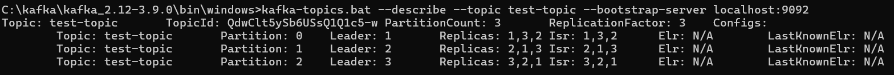
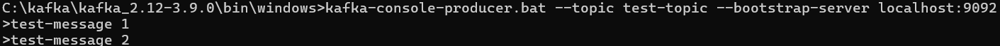
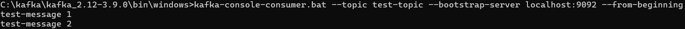

### Project Name: Kafka Cluster Setup on Windows

---

### Overview

This documentation provides a step-by-step guide to setting up an Apache Kafka cluster with three brokers (broker01, broker02, broker03) on a Windows/Linux/MacOS machine without Docker. It covers prerequisites, installation, and configuration, along with testing and troubleshooting tips.

## Tutorials

### Installation

#### Step 1: Install Java
1. Download and install the Java Development Kit (JDK) (at least JDK 8).

#### Step 2: Download and Extract Apache Kafka
1. Download Kafka binary files from the [Apache Kafka Downloads page](https://kafka.apache.org/downloads).
2. Extract Kafka to a directory of your choice, such as `C:\kafka`.

---

### Setup

#### Step 3: Configure ZooKeeper
1. Navigate to the Kafka config directory (`C:\kafka\kafka_2.12-3.9.0\config`) and open the `zookeeper.properties` file.
2. Configure ZooKeeper by setting:
   ```properties
   dataDir=C:/kafka/kafka_2.12-3.9.0/data/zookeeper
   clientPort=2181
   maxClientCnxns=60
   ```
3. Start ZooKeeper in a terminal, on the directory 'C:\kafka\kafka_2.12-3.9.0\bin\windows>':
   ```bash
   zookeeper-server-start.bat C:\kafka\kafka_2.12-3.9.0\config\zookeeper.properties
   ```

#### Step 4: Configure Kafka Brokers
1. Copy `server.properties` to create separate configs:
  - `broker01.properties`
  - `broker02.properties`
  - `broker03.properties`

2. Edit each file with the following configurations:

  - **broker01.properties**
    ```properties
    broker.id=1
    listeners=PLAINTEXT://localhost:9092
    log.dirs=C:/kafka/kafka-logs-broker01
    zookeeper.connect=localhost:2181
    ```

  - **broker02.properties**
    ```properties
    broker.id=2
    listeners=PLAINTEXT://localhost:9093
    log.dirs=C:/kafka/kafka-logs-broker02
    zookeeper.connect=localhost:2181
    ```

  - **broker03.properties**
    ```properties
    broker.id=3
    listeners=PLAINTEXT://localhost:9094
    log.dirs=C:/kafka/kafka-logs-broker03
    zookeeper.connect=localhost:2181
    ```

---

### Quick Start

#### Step 5: Start Kafka Brokers
In separate terminals, run on the directory: C:\kafka\kafka_2.12-3.9.0\bin\windows>:
```bash
kafka-server-start.bat C:\kafka\kafka_2.12-3.9.0\config\broker01.properties
```
```bash
kafka-server-start.bat C:\kafka\kafka_2.12-3.9.0\config\broker02.properties
```
```bash
kafka-server-start.bat C:\kafka\kafka_2.12-3.9.0\config\broker03.properties
```

---

## How-To Guides

### How to Configure Multiple Kafka Brokers
Each Kafka broker requires a unique `broker.id`, `listeners` port, and `log.dirs` directory. Set the `broker.id` to a unique integer, assign different ports for `listeners`, and separate log directories for each broker configuration.

### How to Create and Manage Topics
1. Open a terminal and create a topic with multiple partitions, on the directory: C:\kafka\kafka_2.12-3.9.0\bin\windows>:
   ```bash
   kafka-topics.bat --create --topic test-topic --bootstrap-server localhost:9092 --replication-factor 3 --partitions 3
   ```

2. Verify topic partition distribution, on the directory:
   ```bash
   kafka-topics.bat --describe --topic test-topic --bootstrap-server localhost:9092
   ```

### How to Test the Cluster
1. **Produce Messages**:
   ```bash
   kafka-console-producer.bat --topic test-topic --bootstrap-server localhost:9092
   ```
2. **Consume Messages**:
   ```bash
   kafka-console-consumer.bat --topic test-topic --bootstrap-server localhost:9092 --from-beginning
   ```

---

## Appendix
- **Cluster validation screenshots:**

- **Producer:**

- **Consumer:**

---

## References
1. **How to Run Apache Kafka on Windows** - [https://www.confluent.io/blog/](https://www.confluent.io/blog/set-up-and-run-kafka-on-windows-linux-wsl-2/#download-kafka)