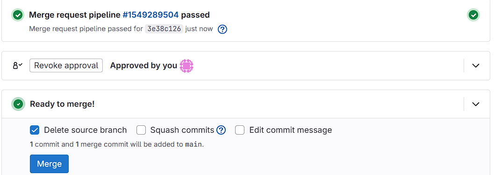
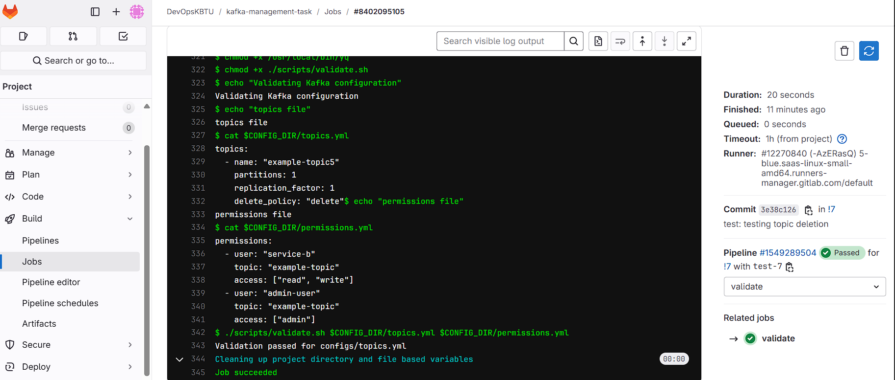
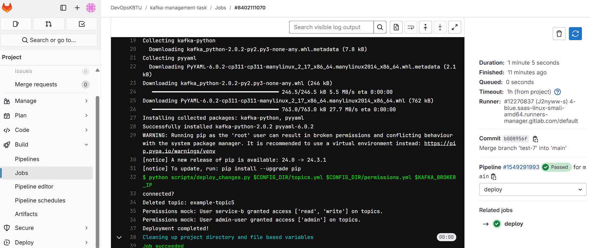

# Task #4. Kafka management

### Objective
The project implements a system where Kafka topic changes (such as creation and deletion) and user permissions can be proposed via merge requests in a version-controlled environment (e.g., GitLab). The system uses a GitLab CI/CD pipeline to validate and deploy Kafka topic configurations and user permissions.

---

## Requirements

- **Remote Server with Ubuntu 22.04 on Virtual Machine with at least 4GB of RAM**
- **Python3** for executing deployment scripts

---

### Tutorials

We have used **Azure Virtual Machine** with **Ubuntu 22.04** as the environment for Kafka. Below are the detailed setup instructions.

---

### Step-by-Step Setup

#### Step 1 — Creating a User for Kafka

We need to configure Kafka for this task on remote server by connecting though 
```bash
ssh username@public_ip
  ```

1. Log in to your server as a non-root sudo user.
2. Create the `kafka` user:
   ```bash
   sudo adduser kafka
   ```
3. Add the `kafka` user to the `sudo` group:
   ```bash
   sudo adduser kafka sudo
   ```
4. Switch to the `kafka` user:
   ```bash
   su -l kafka
   ```

#### Step 2 — Downloading and Extracting the Kafka Binaries

1. Create a directory for downloads:
   ```bash
   mkdir ~/Downloads
   ```
2. Download the Kafka binaries:
   ```bash
   curl "https://downloads.apache.org/kafka/2.8.2/kafka_2.13-2.8.2.tgz" -o ~/Downloads/kafka.tgz
   ```
3. Create a Kafka directory and extract the archive:
   ```bash
   mkdir ~/kafka && cd ~/kafka
   tar -xvzf ~/Downloads/kafka.tgz --strip 1
   ```

#### Step 3 — Configuring the Kafka Server

1. Open Kafka's `server.properties` file:
   ```bash
   nano ~/kafka/config/server.properties
   ```
2. Add the following lines:
- Enable topic deletion:
  ```bash
  delete.topic.enable = true
  ```
- Change the log directory:
  ```bash
  log.dirs=/home/kafka/logs
  ```
3. Save and close the file.

#### Step 4 — Creating systemd Unit Files and Starting Kafka

1. **Create the Zookeeper Service Unit File**:
   ```bash
   sudo nano /etc/systemd/system/zookeeper.service
   ```
   Add the following content:
   ```bash
   [Unit]
   Requires=network.target remote-fs.target
   After=network.target remote-fs.target

   [Service]
   Type=simple
   User=kafka
   ExecStart=/home/kafka/kafka/bin/zookeeper-server-start.sh /home/kafka/kafka/config/zookeeper.properties
   ExecStop=/home/kafka/kafka/bin/zookeeper-server-stop.sh
   Restart=on-abnormal

   [Install]
   WantedBy=multi-user.target
   ```

2. **Create the Kafka Service Unit File**:
   ```bash
   sudo nano /etc/systemd/system/kafka.service
   ```
   Add the following content:
   ```bash
   [Unit]
   Requires=zookeeper.service
   After=zookeeper.service

   [Service]
   Type=simple
   User=kafka
   ExecStart=/bin/sh -c '/home/kafka/kafka/bin/kafka-server-start.sh /home/kafka/kafka/config/server.properties > /home/kafka/kafka/kafka.log 2>&1'
   ExecStop=/home/kafka/kafka/bin/kafka-server-stop.sh
   Restart=on-abnormal

   [Install]
   WantedBy=multi-user.target
   ```

#### Step 5 — Adding Configuration Files

Add the necessary configuration files (`topics.yml` and `permissions.yml`) in your `configs` directory to manage Kafka topics and user permissions.

---

### How-To Guides

#### How to Setup the Development Environment

1. **Create a git repository**:
  create a .gitlab-ci.yml file
```yaml
image: ubuntu:20.04
stages:
  - validate
  - deploy

variables:
  CONFIG_DIR: "configs"
  KAFKA_BROKER: $KAFKA_BROKER_IP:9092

before_script:
  - apt-get update && apt-get install -y wget
  - wget https://github.com/mikefarah/yq/releases/latest/download/yq_linux_amd64 -O /usr/local/bin/yq
  - chmod +x /usr/local/bin/yq
  - chmod +x ./scripts/validate.sh

validate:
  stage: validate
  script:
    - echo "Validating Kafka configuration"
    - echo "topics file"
    - cat $CONFIG_DIR/topics.yml
    - echo "permissions file"
    - cat $CONFIG_DIR/permissions.yml
    - ./scripts/validate.sh $CONFIG_DIR/topics.yml $CONFIG_DIR/permissions.yml
  only:
    - merge_requests

deploy:
  stage: deploy
  image: python:3.11
  before_script:
    - pip install kafka-python pyyaml
  script:
    - python scripts/deploy_changes.py $CONFIG_DIR/topics.yml $CONFIG_DIR/permissions.yml $KAFKA_BROKER_IP
  only:
    - main
```

2. **Set Up the Configuration Files**:
  - In the `configs` directory, create `topics.yml` and `permissions.yml` files as per your requirements.

3. **Create scripts**:
  - Script for deploy stage
    Copy the deploy_changes.py script and add to you directory
  - Script for validating yml files
```bash
  #!/bin/bash

CONFIG_TOPICS=$1
CONFIG_PERMISSIONS=$2

if ! yq eval '.' "$CONFIG_TOPICS" > /dev/null 2>&1; then
  echo "Invalid topics YAML file: $CONFIG_TOPICS"
  exit 1
fi

if ! yq eval '.' "$CONFIG_PERMISSIONS" > /dev/null 2>&1; then
  echo "Invalid permissions YAML file: $CONFIG_PERMISSIONS"
  exit 1
fi

echo "Validation passed for $CONFIG_TOPICS"

```

#### How to Create and Submit Merge Requests for Kafka Topic and Permission Changes

1. **Create a new branch and checkout it**
```bash
  git checkout -b <branch-name>
```

2. **Create or Modify the `topics.yml` and `permissions.yml`** files with your Kafka topic and permission changes.

3. **Commit and Push the Changes**:
  - Commit your changes with a descriptive message:
    ```bash
    git commit -am "Add new topic and update permissions"
    git push origin feature-branch
    ```

4. **Submit a Merge Request**:
  - Go to your GitLab repository and open a merge request (MR) for the changes.
  - After pushing the changes on configs the pipeline should already be started
  - If pipeline is successful we can merge it
    
  - After merging the deploying stage should start
    

#### How the CI/CD Pipeline Works

1. **Merge Request Triggers Validation**:
  - When a merge request is created, the pipeline triggers the `validate` stage. It checks the validity of the `topics.yml` and `permissions.yml` files using the `validate.sh` script.

2. **Deployment Stage**:
  - If the validation passes, the `deploy` stage is triggered. The `deploy_changes.py` script runs, applying the changes to the Kafka broker (creating/deleting topics and applying permissions).

---

### CI/CD Pipeline Example

1. **Sample `topics.yml` that creates new-topic**:
   ```yaml
   topics:
     - name: "new-topic"
       partitions: 1
       replication_factor: 1
       delete_policy: "create"
   ```

2. 1. **Sample `topics.yml` that deletes new-topic**:
```yaml
topics:
  - name: "new-topic"
    partitions: 1
    replication_factor: 1
    delete_policy: "delete"
```

3. **Sample `permissions.yml`**:
   ```yaml
   permissions:
     - user: "service-b"
       topic: "new-topic"
       access: ["read", "write"]
     - user: "admin-user"
       topic: "new-topic"
       access: ["admin"]
   ```

3. **Example Execution**:
  - After submitting the merge request, the pipeline runs, and the `validate.sh` script validates the YAML files.
    
    
  - If valid, the `deploy_changes.py` script applies the changes to the Kafka broker.
    
---

### Explanations

- **Concept Overview**:
  - This system leverages GitLab's CI/CD pipelines to automatically validate and deploy Kafka topic changes and permissions via version-controlled merge requests.

- **Design Decisions**:
  - The use of YAML files for topic and permission configurations ensures ease of editing and version control.
  - Kafka operations are handled by the `kafka-python` library, ensuring cross-platform compatibility.

- **Technical Background**:
  - Kafka AdminClient from `kafka-python` is used for creating and deleting topics. Permissions are handled via mock implementation for now but can be expanded as needed.

---


### References

- [GitLab CI/CD YAML syntax reference](https://docs.gitlab.com/ee/ci/yaml/#tags)
- [Working with YAML Python](https://python.land/data-processing/python-yaml#Installing_and_importing_PyYAML)
- [Create Linux VM on Azure](https://learn.microsoft.com/en-us/azure/virtual-machines/linux/quick-create-portal?tabs=ubuntu)
- [Apache Kafka Downlad](https://kafka.apache.org/downloads)
- [How To Install Apache Kafka on Ubuntu 20.04](https://www.digitalocean.com/community/tutorials/how-to-install-apache-kafka-on-ubuntu-20-04#step-1-mdash-creating-a-user-for-kafka)
- [Kafka with Python](https://kafka-python.readthedocs.io/en/master/apidoc/KafkaAdminClient.html)

---

This `README.md` should guide users through setting up the environment, creating and submitting merge requests, and understanding the CI/CD pipeline's functionality.