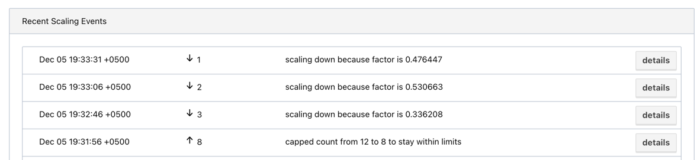

## Task #4. Auto-scaling

Automatically adjust the number of instances based on CPU or memory utilization.
Generate artificial CPU or memory load to trigger the auto-scaling policy.

## Usage

Firstly run nomad agent.
```bash
nomad agent -config=./config
```

To use autoscaling we need to use provided Auto-Scaler from hashicorp.
```bash
docker run \
    --volume ./scaler-config:/config \
    hashicorp/nomad-autoscaler nomad-autoscaler agent -config /config
```

To run the job:
```bash
nomad job run deploy-dynamic.nomad
```

Then we can generate some traffic and see autoscaling magic.



